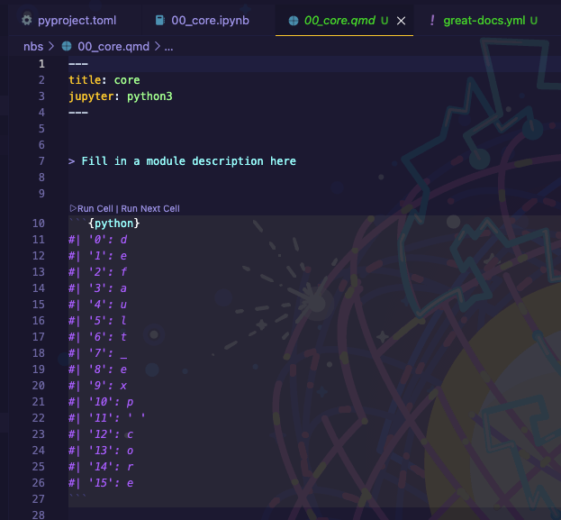
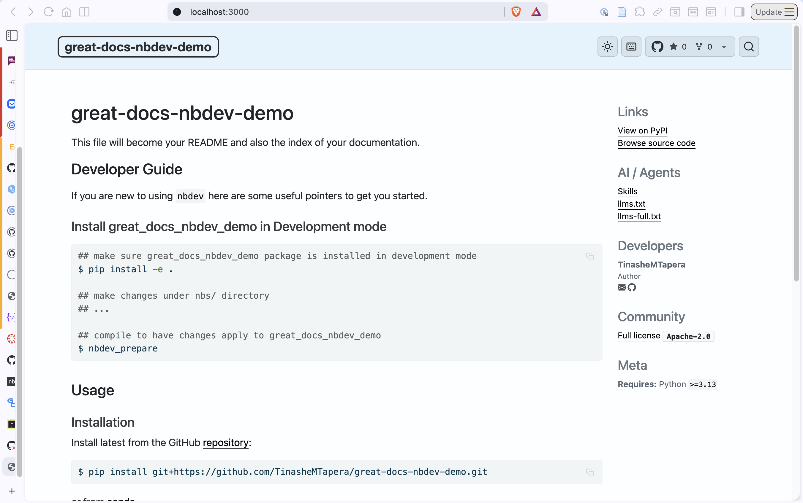
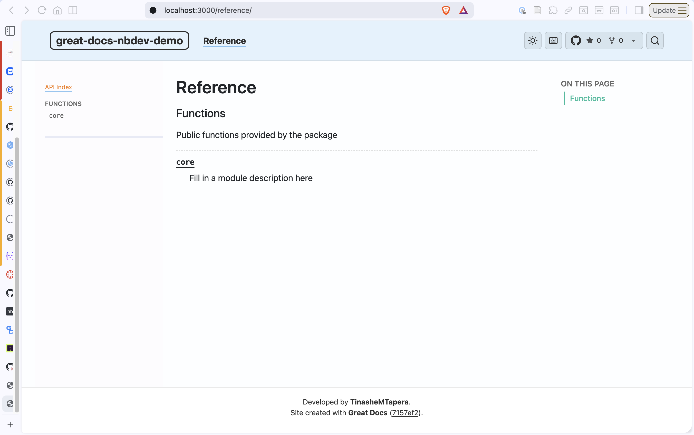
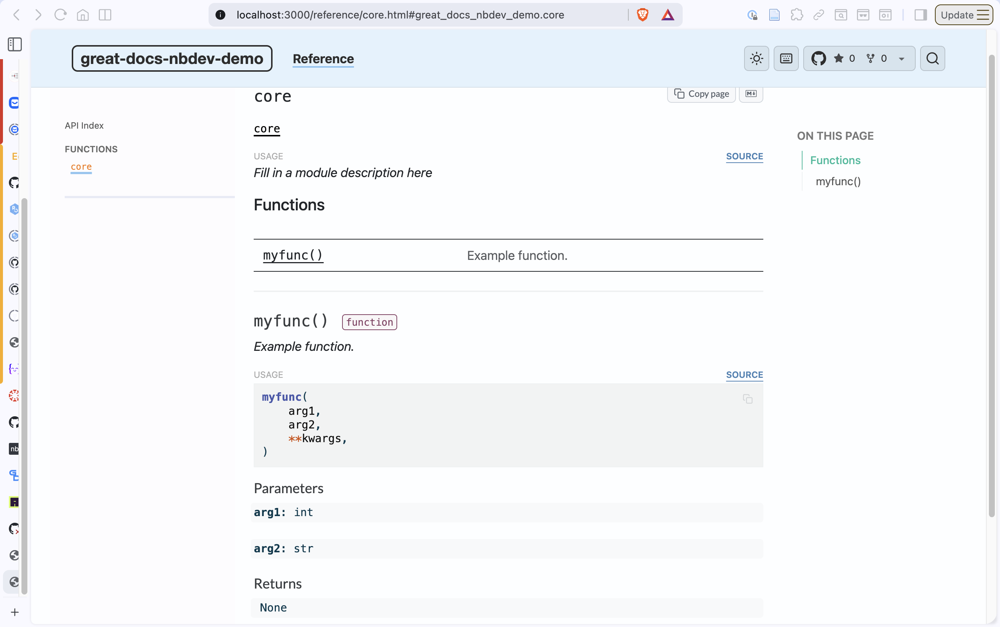

Posit just announced the release of their new Quarto-based Python package documentation site generator: [`great-docs`](https://posit-dev.github.io/great-docs/).

::: {.callout-note}
[Click here to skip to the tutorial](#ready-to-try-out-great-docs)
:::

`great-docs` promises to inspect your Python package and generate a beautiful, fully featured documentation website, featuring:

- API reference
- CLI reference 
- A snazzy landing page
- Space for user guides, blog posts, tutorials, dev notes, notebooks, etc.

In the R world, we’ve been blessed for many years with [`pkgdown`](https://pkgdown.r-lib.org/), 
and I’ll be honest — it's one of my top reasons to start a multilingual project in R 
as opposed to Python. With `pkgdown`, you use [Roxygen tags](https://roxygen2.r-lib.org/reference/tags-rd.html)
(analogous to Python decorators) to annotate your functions, and as `pkgdown` scans your 
R scripts, it pulls out the tags and fills out R package-compliant documentation files. 
Once these files are complete, `pkgdown` automates the generation of a 
package documentation website, which can then be hosted by GitHub Pages or otherwise. 
Today, `pkgdown` sites are ubiquitous and instantly identifiable, and — in my opinion — are
a strong indicator of R code quality and attention to detail.

Of course, Python has documentation management for a long time, too. 
The first time I documented a Python package was with [Sphinx-doc](https://www.sphinx-doc.org/en/master/), 
and it was...alright. It was certainly more work than Roxygen, 
requiring an entirely unique phase of development to generate, tidy up, and deploy. 
Since then, numerous other documentation mechanisms have popped up thanks to 
Python’s various docstrings specifications, including [Google Style](https://google.github.io/styleguide/pyguide.html), 
[Numpy](https://numpy.org/doc/stable/), [Sphinx](https://www.sphinx-doc.org/en/master/), [Epytext](https://epytext.readthedocs.io/en/latest/), 
and possibly more I'm unaware of. One of my gripes with Python is that 
because it is so easy to publish new things, Python is a bit of an "anything goes," "wild west" language, 
and the documentation space is no different. Each time someone has attempted to 
establish, "the next best docstring format," we’ve ended up back in the 
"conflicting standards," comic all over again:


Now, we have `great-docs`. So why will this time around be any different? Here’s my opinion:

## `great-docs` is NOT a Docstring Style Specification

Despite what I initially thought, the Posit team is not suggesting we 
adopt a new specification. In my opinion, that decision would be 
counterproductive (as XKCD rightly points out). Instead, `great-docs` is 
a Quarto-driven _documentation generator_. Instead of trying to 
convince the Python community to change its ways yet again, 
and writing a brand new parser for a a new decorator style, 
`great-docs` accepts multiple docstring styles and implements a 
universal parser to ingest them, spitting out a unified API documentation
that any Python user can read and easily understand. 
At present, the `great-docs` documentation tells us that it 
accepts (and automatically detects😱) `numpy`, Google, and Sphinx styles. 

## `great-docs` is Driven By Quarto

Quarto is certainly picking up speed in the data science community, 
with the number of adopters increasing all the time. 


The easier it is to integrate Quarto into people’s existing software 
development infrastructure, the more confidence I have that this will 
be a worthwhile project. Furthermore, because Quarto has rich 
and accessible [extension functionality](https://quarto.org/docs/extensions/), 
I have no doubt that we’re about to see an explosion of 
creative ideas and tools.[^1]

[^1]: The extension ecosystem is already exploding, check out the [`awesome-quarto`](https://github.com/mcanouil/awesome-quarto) GitHub repo for some interesting examples.

## Pseudo-Corporate Backing

Hear me out — as an academic and member of the FOSS community, I am 
weary of anytime a company promotes a package as a standard for an 
open source language. However, in this case, we’re talking about Posit PBC, 
which is a [registered non-profit](https://posit.co/about). In case you’re unaware, Hadley Wickham 
is the tech-brain behind the venture, with JJ Allaire and Tareef Kawaf serving
as co-founders. Wickham started out as an R developer back when the company
was called RStudio. Today, RStudio is synonymous with R itself, 
so if you’ve trusted RStudio this far as a company, I’d bet you can 
trust Posit, and by extension, their products, Quarto being one of their flagships.

## Multilinguists Will Now Have An Easy On-Ramp

There are a lot of R users who feel skittish about Python. 
Since they normally come from the statistics world, and Python sits squarely in the software 
engineers' world, R users sometimes have a hard time getting 
into the Python community. Fortunately, Posit has positioned 
itself as a polyglot data science developer company first and foremost[^2]. As a result, 
its R userbase may be more likely to get their feet wet with Python, 
since they already know Quarto and will have a sense of familiarity with 
Posit’s approach to open, welcoming, multilingual data science. 
Likewise, [Pythonistas](https://medium.com/byte-sized-code/are-you-a-pythonista-197debd5efa6) 
might get more involved in the world of R, since the two communities are starting to overlap more and more.

## Verdict

I’m _obviously_ biased, as a fan of everything Posit has done. 
However, I am still trepidatious. I haven’t fully adopted Positron as my IDE, 
mainly because I’ve not had error free integration of remote-SSH; I work on 
HPC compute clusters in academia, so that is non-negotiable. 
I acknowledge, though, that this may not exactly be Positrons shortcoming, 
but instead due to the fact that each HPC cluster is different and requires 
a niche implementation of the IDEs it can run. Additionally, I didn’t have 
tremendous luck connecting to a MySQL Server instance a few weeks ago.

That being said, everything else I’ve used from Posit has been damn near 
excellent, and has only added positives to my data journey. I’m certainly 
going to embrace `great-docs`, and I've already opened an issue 
to have it integrated into my favourite Python package, `nbdev`, 
for notebook-driven development and documentation. 
I _believe_, we’ll only need to replace the `nbdev-preview` step with `great-docs`.

[^2]: Check out Wes McKinney's [talk at `jupytercon`](https://www.youtube.com/watch?v=wdmf1msbtVs) where he talks about how Posit is firmly committed to supporting the Python community, and how develop polyglot data science tools. 

## Ready to try out `great-docs`?

Getting started with `great-docs` is dead easy. In my case, 
I’m going to combine this with `nbdev` which allows you to 
develop packages in notebooks. So, as a prequisite, I’ve started 
a new `nbdev` project in the following way:

```bash
# starting from github, create an empty repo, and clone it to your local machine
git clone TinasheMTapera/great-docs-nbdev-demo

# use uv to create a new virtual environment and install nbdev
cd great-docs-nbdev-demo
uv init .

# important: great-docs requires Python > 3.11
uv venv --python 3.13
source .venv/bin/activate

```

With `uv` ready, install `nbdev`:

```bash
uv pip install nbdev

# dont forget to git
git add .
git commit -am "Initialize project"
```

### Hack #1: Resolve the `uv` and `nbdev` TOML clash

Here's our first clash: `uv` has already insisted on a .pyproject.toml file, 
which is where it manages our dependencies and virtual environment. `nbdev` also wants to
create a `pyproject.toml` file, and fails to initialize. This will have to be resolved in
the future, but for now, I'll delete `uv`'s TOML since it is barebones anyway:

```bash
# remove the stuff that uv created
rm pyproject.toml main.py

nbdev-new 

# dont forget to git
git add .
git commit -m "add uv and nbdev to the project"
```

### Hack #2: Resolve the `uv` and `nbdev` Python version clash

Here comes our second clash: `nbdev` requires Python > 3.12, but
`uv` may not have defaulted to that. Open up the `pyproject.toml` file that `nbdev` 
created, and make sure the Python version is set to 3.13.

Next, make sure Quarto is installed:

```bash
brew install cask quarto
```

And then, install `great-docs` from `pip`

```bash
# takes less than a second, awesome! 🤩
uv pip install great-docs

# don't forget to add these all for the project
uv pip install ipykernel jupyter
uv add ipykernel jupyter nbdev great-docs quarto

git add --all
git commit -m "Install great-docs and dependencies"
```

Awesome. At this stage, you should have the following:

```
(great-docs-nbdev-demo) (base) ➜  great-docs-nbdev-demo git:(main) ✗ tree -L 2                    
.
├── LICENSE
├── MANIFEST.in
├── README.md
├── _proc
│   ├── 00_core.ipynb
│   ├── _docs
│   ├── _quarto.yml
│   ├── index.ipynb
│   ├── nbdev.yml
│   └── styles.css
├── great_docs_nbdev_demo
│   ├── __init__.py
│   ├── _modidx.py
│   └── core.py
├── great_docs_nbdev_demo.egg-info
│   ├── PKG-INFO
│   ├── SOURCES.txt
│   ├── dependency_links.txt
│   ├── entry_points.txt
│   ├── requires.txt
│   └── top_level.txt
├── nbs
│   ├── 00_core.ipynb
│   ├── _quarto.yml
│   ├── index.ipynb
│   ├── nbdev.yml
│   └── styles.css
├── pyproject.toml
└── uv.lock

6 directories, 24 files
```

Next, open up your Jupyter notebook for the `core` module as normal for `nbdev`,
add a function or two, and add some docstrings in your preferred style. For example:

```python
def myfunc(arg1, arg2, **kwargs):
    """
    Example function.

    Parameters
    ----------
    arg1 : int
    arg2 : str

    Returns
    -------
    None
    """
    pass
```

Once you've added that function, some markdown to discuss and document your code,
and inserted the docstrings, you can run the `nbdev` command to export your notebooks to .py files:

```bash
nbdev-export
git commit -am "Export notebooks to .py files"
```

Notice that the `nbs` folder has the notebooks, and the `great_docs_nbdev_demo`
folder has the .py files that were generated from the notebooks. Now, instead of
running `nbdev-preview` to generate the documentation site, you can run `great-docs`:

```
(great-docs-nbdev-demo) (base) ➜  great-docs-nbdev-demo git:(main) ✗ great-docs init
Initializing great-docs...
Detecting docstring style...
Docstring style detection: numpy=1, google=0, sphinx=0
Detected numpy docstring style
Discovered 1 public names
Auto-excluding 1 item(s): core
Warning: Could not discover exports, creating minimal config
Testing dynamic introspection mode...
Dynamic introspection mode works for this package
Created /Users/tit420/projects/great-docs-nbdev-demo/great-docs.yml

The great-docs/ directory is ephemeral and should not be committed to git.
Add 'great-docs/' to .gitignore? [Y/n]: y
✅ Updated .gitignore to exclude great-docs/ directory

✅ Great Docs initialization complete!

Next steps:
1. Review great-docs.yml to customize your API reference structure
   (Reorder items, add sections, set 'members: false' to exclude methods)
2. Run `great-docs build` to generate and build your documentation site
3. Run `great-docs preview` to view the site locally

Other helpful commands:
  great-docs scan           # Preview API organization
  great-docs build --watch  # Watch for changes and rebuild
```

Notice that it added its stuff to the `.gitignore`, which is nice. Initializing
`great-docs` creates a `great-docs.yml` file, which is where you can customize 
the structure of your API reference. Details of what you can do with that are
available in the `great-docs` documentation, but you can explicitly name modules,
exclude sections, include CLIs, add cosmetic and Quarto-specific elements, and more.

Specifically, to document one of your functions, uncomment the section of the `great-docs.yml` file that looks like this:

```yaml
# API Reference Structure
# -----------------------
# Auto-discovery couldn't determine your package's public API.
# You can manually specify which items to document here.
#
# Uncomment and customize the reference section below:
#
reference:
  - title: Functions
    desc: Public functions provided by the package
    contents:
      - core # add the name of the python file here, without the .py extension. This will document all public functions in that file.
```
### Hack #3: I Thought We Were Using QMDs?

To add the actual notebook content to the site, you'll need
to add Quarto Markdown files to the `nbs` folder, and then tell
`great-docs` to include them in the site. `nbdev` has not yet 
integrated QMD support, but 
[this Pull Request](https://github.com/AnswerDotAI/nbdev/pull/1521) has implemented it
perfectly. We can quickly switch over to that version:

```bash
uv pip install git+https://github.com/bhoov/nbdev
```

And convert the notebooks with Quarto convert:

```bash
ls nbs/*.ipynb | xargs -n 1 -P 4 -I {} quarto convert "{}"
```

This isn't perfect; you'll notice that Quarto borked 
the directives:



So, you're gonna have to fix those manually. Not a huge deal,
but worth flagging for the `nbdev` team to consider in their 
future integration of Quarto support.

In addition, Quarto will raise an error about the `nbdev` 
directives, since they are not valid Quarto directives.
Thanks to [this issue thread](https://github.com/quarto-dev/quarto-cli/issues/3152#issuecomment-1466415796), we know
that we can get around this by adding a yaml value to each
non-compliant directive.

Export the fixed notebooks to Python modules again with `nbdev-export`, and then add 
`sections` to the `great-docs.yml` file, and point it to 
the `nbdev`'s `nbs` folder that you want to include:

```bash
nbdev-export
```

```yaml
sections:
  - title: Documentation with `nbdev`
    dir: nbs
```

See [this page](https://posit-dev.github.io/great-docs/user-guide/custom-sections.html) for more configuration options for adding qmd notebooks to the project.

Once you're ready, run `great-docs build` to generate the documentation site:

```bash
great-docs build
# if successful, you should see a message like this:
# 🎉 Your site is ready! Open: /Users/tit420/projects/great-docs-nbdev-demo/great-docs/_site/index.html

great docs preview
```

And just like that, you have a documentation site for your Python package, with an API reference that was automatically generated from your docstrings!

{group="my-gallery"}

{group="my-gallery"}

{group="my-gallery"}

Happy coding, and remember, documentation is not a chore, it's a love letter to your future self and your users. 
With a combination of notebook-driven development in `nbdev`, and the ease of use of `great-docs`, you can make that 
love letter as great as the code it describes. 💌✨
